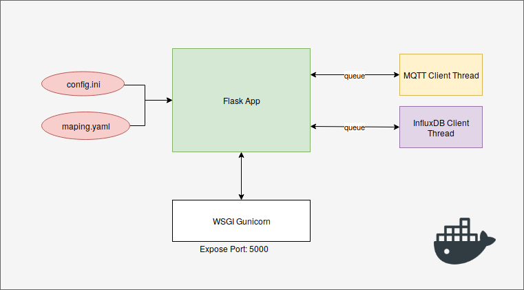
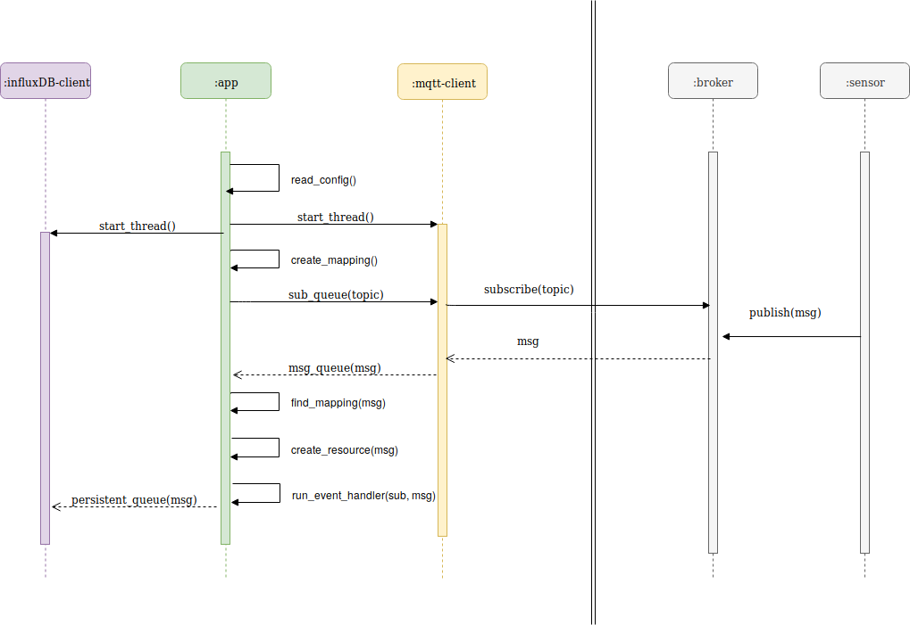

.. rest-mqtt-proxy documentation master file, created by
   sphinx-quickstart on Fri Nov 16 00:53:16 2018.
   You can adapt this file completely to your liking, but it should at least
   contain the root `toctree` directive.

=========
Overview
=========

This section contains information about the System-Architecture and the basic Workflow.

System-Architecture
===================

The Main Entry-Point starts an Flask Web Application and one thread for the MQTT-Client and another for InfluxDB-Client.
To serve the Web-Application there also starts an Gunicorn Worker who acts as Web Service Gateway Interface (WSGI).

For the communication between these thread there are several Queue used:

- sub_queue => To subscribe Topics
- msg_queue => For all incoming messages
- persistent_queue =>  For influxDB persistent manager
- pub_queue =>  For all messages to publish

Workflow
=========

First the Main-Thread read all config files and start the different Client-threads. (:ref:`app-config-file-label`)

After that it creates the Mapping Resources from kind "MQTTSubscriptionV1" and put all topics that should be subscribe in the sub_queue. (:ref:`pre-mapping-dir-label`)

The MQTT Client reads this queue and subscribe these Topics from the Broker.

If some Sensor-Client Publish a Message that match one of these Subscriptions, then the message will be forwarded to the Main-Thread by the msg_queue.

Then the Main-Thread search for a matching Resource and than update the corresponding value. If there is no resource than its create a new once.

In the last step the Main-Thread execute all defined event_handlers for this Subscription.